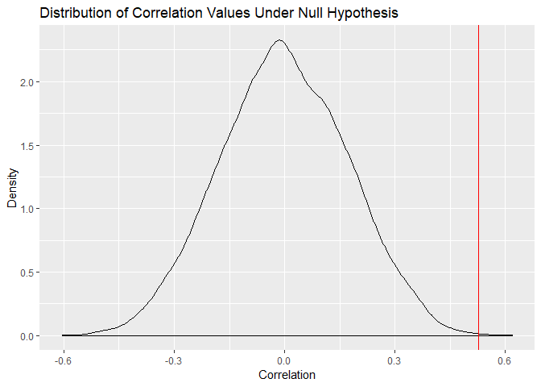

Climate Change
================

Climate change is an ongoing issue that scientists frequently debate
about. Though there are many factors which contribute to rising average
temperatures across the United States, one claim is that crude oil
consumption directly affects the rising temperatures. As statisticians,
we understand that both variables are observational, meaning that there
can be correlation between the two variables, but causation cannot be
concluded. Thus, for this study, we are interested in discovering
whether there is significant correlation between crude oil consumption
levels and average temperature readings. The dataset ‘oil-temp.csv’ has
been provided and contains the following variables:

year: Measurement year crude\_oil\_consumption1: Total annual US crude
oil imports measured in thousands of barrels temp\_change: Average
change in US temperatures by degrees Fahrenheit

Given this data, our hypotheses are as follows: \* H0:cor=0 \* Ha:cor≠0

Calculate the actual correlation coefficient between
crude\_oil\_consumption and temp\_change (5 points) Perform a
permutation test with 10,000 samples and store the results in a vector
(15 points) Create a histogram of your permutation test results and
include a red line for the actual correlation value (10 points)
Calculate the p value for the observed correlation coefficient and its
95% confidence interval (10 points) What do you conclude? (5 points)

-----

Load
    packages.

``` r
library(tidyverse)
```

    ## -- Attaching packages ------------------------------------------------------- tidyverse 1.2.1 --

    ## v ggplot2 3.1.0     v purrr   0.2.5
    ## v tibble  1.4.2     v dplyr   0.7.8
    ## v tidyr   0.8.2     v stringr 1.3.1
    ## v readr   1.3.1     v forcats 0.3.0

    ## -- Conflicts ---------------------------------------------------------- tidyverse_conflicts() --
    ## x dplyr::filter() masks stats::filter()
    ## x dplyr::lag()    masks stats::lag()

``` r
library(infer)
```

-----

Import data.

``` r
oil <- read_csv('oil-temp.csv')
```

    ## Parsed with column specification:
    ## cols(
    ##   year = col_double(),
    ##   crude_oil_consumption = col_double(),
    ##   temp_change = col_double()
    ## )

Viewing data.

``` r
head(oil)
```

    ## # A tibble: 6 x 3
    ##    year crude_oil_consumption temp_change
    ##   <dbl>                 <dbl>       <dbl>
    ## 1  1981               5861058        1.1 
    ## 2  1982               5582938       -0.67
    ## 3  1983               5559364       -0.14
    ## 4  1984               5755575       -0.04
    ## 5  1985               5740143       -0.72
    ## 6  1986               5942429        1.3

Let’s calculate the true correlation between temperature and crude oil
consumption.

``` r
(samp_corr <- oil %>%
  summarize(Correlation = cor(crude_oil_consumption, temp_change)))
```

    ## # A tibble: 1 x 1
    ##   Correlation
    ##         <dbl>
    ## 1       0.529

``` r
samp_corr <- samp_corr %>%
  pull()
```

Since the correlation is between oil consumption and temperature on a
yearly basis, if we randomize temperatures, it will break the
correlation and create data that fits our null hypothesis. I’ll do this
using the ‘tidyverse’ by creating 10,000 samples of our original data,
then permuting the ‘temp\_change’ variable for each sample then
calculating the correlation between ‘temp\_change’ and
‘crude\_oil\_consumption’ for each sample.

``` r
perm_corrs <- oil %>%
  rep_sample_n(size = nrow(oil), reps = 10000) %>%
  group_by(replicate) %>%
  mutate(perm_temp = sample(temp_change)) %>%
  summarize(Correlation = cor(crude_oil_consumption, perm_temp))
```

Plot the correlation values under the null hypothesis and include a red
verticle line at the correlation we calculated from our actual sample.

``` r
perm_corrs %>%
  ggplot(aes(x = Correlation)) +
  geom_density() +
  geom_vline(xintercept = samp_corr, col = 'red') +
  labs(y = 'Density',
       title = 'Distribution of Correlation Values Under Null Hypothesis')
```

<!-- -->

Calculate the p-value and 95% confidence interval for the observed
correlation coefficient.

``` r
perm_corrs %>%
  summarize(P_Value = mean(Correlation >= samp_corr),
            Lower_Bound = P_Value - qnorm(0.975) * sqrt(P_Value * (1 - P_Value) / n()),
            Upper_Bound = P_Value + qnorm(0.975) * sqrt(P_Value * (1 - P_Value) / n()))
```

    ## # A tibble: 1 x 3
    ##   P_Value Lower_Bound Upper_Bound
    ##     <dbl>       <dbl>       <dbl>
    ## 1  0.0005   0.0000618    0.000938

Since our null hypothesis is that the correlation is not equal to zero,
we are conducting a two sided test. To be significant, we would need to
have a p-value of less 0.025 (alpha = 0.05) Based on this permutation
test, we can conclude that the observed correlation between crude oil
consumption and average yearly temperature change is greater than 0 at a
statistically significant level since the p-value is much smaller than
0.025 and the 95% confidence interval that we calculated does not
contain the cutoff value of 0.025.
