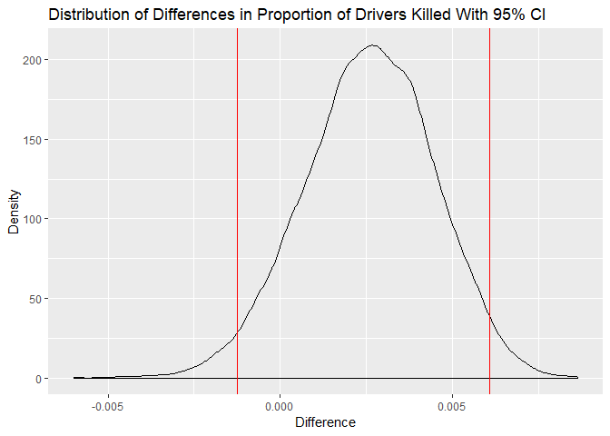

Seatbelts
================

The built-in R dataset Seatbelts contains details about driver deaths
and injuries in Great Britain from Jan 1969 to Dec 1984. More
information about the data can be accessed by running ?Seatbelts.

This data contains 8 columns and 192 rows of data. The law column is
either a 0 or 1 indicating whether or not a law was in place requiring a
seatbelt to be worn. We want to know if this law had an impact on the
proportion of drivers who were killed out of those who were seriously
injured. This proportion is calculated by dividing DriversKilled by
drivers.

  - Calculate the observed difference in proportion of drivers killed
    when the law was in effect and when it was not in effect (10 points)
  - Calculate 10,000 bootstrapped differences in proportions and store
    the results in a vector (15 points)
  - Based on the results from step 2, calculate a 95% confidence
    interval on the difference in proportion of drivers killed (10
    points)
  - Based on your results, did the law improve the proportion of injured
    drivers who were killed? (5 points)

-----

Load
    packages.

``` r
library(tidyverse)
```

    ## -- Attaching packages ------------------------------------------------------- tidyverse 1.2.1 --

    ## v ggplot2 3.1.0     v purrr   0.2.5
    ## v tibble  1.4.2     v dplyr   0.7.8
    ## v tidyr   0.8.2     v stringr 1.3.1
    ## v readr   1.3.1     v forcats 0.3.0

    ## -- Conflicts ---------------------------------------------------------- tidyverse_conflicts() --
    ## x dplyr::filter() masks stats::filter()
    ## x dplyr::lag()    masks stats::lag()

``` r
library(infer)
```

-----

Load data.

``` r
sblts <- as_data_frame(Seatbelts)
```

View the data.

``` r
head(sblts)
```

    ## # A tibble: 6 x 8
    ##   DriversKilled drivers front  rear   kms PetrolPrice VanKilled   law
    ##           <dbl>   <dbl> <dbl> <dbl> <dbl>       <dbl>     <dbl> <dbl>
    ## 1           107    1687   867   269  9059       0.103        12     0
    ## 2            97    1508   825   265  7685       0.102         6     0
    ## 3           102    1507   806   319  9963       0.102        12     0
    ## 4            87    1385   814   407 10955       0.101         8     0
    ## 5           119    1632   991   454 11823       0.101        10     0
    ## 6           106    1511   945   427 12391       0.101        13     0

I’ll calculate the observed difference in proportion of drivers killed
when the law was in effect and when it was not. In this case, the
‘diff()’ function is subtracting the proportion of drivers killed when
the law was not in effect from the proportion of drivers that were
killed when the law was in effect.

``` r
(actual_diff <- sblts %>%
  group_by(law) %>%
  summarize(Proportion_Killed = sum(DriversKilled) / sum(drivers)) %>%
  summarize(Diff_Prop_Killed = diff(Proportion_Killed)))
```

    ## # A tibble: 1 x 1
    ##   Diff_Prop_Killed
    ##              <dbl>
    ## 1          0.00258

``` r
actual_diff <- actual_diff %>%
  pull()
```

Calculating 10,000 bootstrapped differences in proportions. The code
groups by law (0 or 1) and then takes a random sample with replacement
of all the rows in each group. Then it calculates the difference in
proportion of drivers killed before and after the law change.

``` r
boot_diffs <- sblts %>%
  select(DriversKilled, drivers, law) %>%
  rep_sample_n(size = nrow(.), reps = 10000) %>%
  group_by(replicate, law) %>%
  sample_frac(size = 1, replace = TRUE) %>%    
  summarize(Proportion_Killed = sum(DriversKilled) / sum(drivers)) %>%
  summarize(Diff_Prop_Killed = diff(Proportion_Killed))
```

Calculate a 95% confidence interval on the difference in proportion of
drivers killed.

``` r
(ci <- boot_diffs %>%
  summarize(Lower_Bound = quantile(Diff_Prop_Killed, probs = 0.025),
            Upper_Bound = quantile(Diff_Prop_Killed, probs = 0.975)))
```

    ## # A tibble: 1 x 2
    ##   Lower_Bound Upper_Bound
    ##         <dbl>       <dbl>
    ## 1    -0.00124     0.00609

Visualize the confidence interval.

``` r
boot_diffs %>%
  ggplot(aes(x = Diff_Prop_Killed)) +
  geom_density() +
  geom_vline(xintercept = c(ci$Lower_Bound, ci$Upper_Bound), col = 'red') +
  labs(x = 'Difference',
       y = 'Density',
       title = 'Distribution of Differences in Proportion of Drivers Killed With 95% CI')
```

<!-- -->

Based on the confidence interval from the bootstrap samples, we cannot
conclude that the law improved the proportion of drivers that are killed
in crashes since the 95% confidence interval around the difference in
proportion of drivers killed contains 0. Besides that, our observed
difference in proportions shows that a higher proportion of drivers were
killed after the law went into effect.
