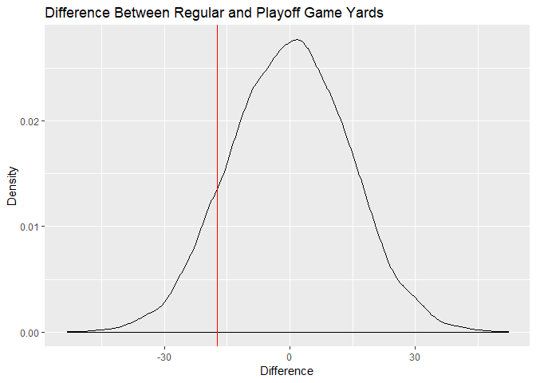

Tom Brady
================

Tom Brady recently won his 6th Superbowl as the quarterback of the New
England Patriots. Many have speculated that what makes Brady so good is
his performance in the biggest situations, like the playoffs. We want to
check if Brady actually throws for more yards in playoff games than he
does in regular season games.

The ‘brady.csv3’ file contains data from all of Brady’s games and
includes the following columns:

  - game\_type: Either “Regular” or “Playoff” indicating which type of
    game was played
  - yards: Number of yards Tom Brady threw for in the game

Given this data, we have the following hypotheses: \*
H0:μplayoff=μregular \* Ha:μplayoff\>μregular

1.  Find the difference in the average yards thrown for in playoff vs
    regular season games (5 points)
2.  Perform a permutation test with 10,000 samples and store the results
    in a vector (15 points)
3.  Calculate the p value for the observed difference in average yards
    thrown and its 95% confidence interval (10 points)
4.  Based on your results, does Tom Brady pass for more yards per game
    in the playoffs when compared to the regular season? (5 points)

-----

Load
    packages.

``` r
library(tidyverse)
```

    ## -- Attaching packages ------------------------------------------------------- tidyverse 1.2.1 --

    ## v ggplot2 3.1.0     v purrr   0.2.5
    ## v tibble  1.4.2     v dplyr   0.7.8
    ## v tidyr   0.8.2     v stringr 1.3.1
    ## v readr   1.3.1     v forcats 0.3.0

    ## -- Conflicts ---------------------------------------------------------- tidyverse_conflicts() --
    ## x dplyr::filter() masks stats::filter()
    ## x dplyr::lag()    masks stats::lag()

``` r
library(infer)
```

-----

Load the data.

``` r
brady <- read_csv('brady.csv')
```

    ## Parsed with column specification:
    ## cols(
    ##   game_type = col_character(),
    ##   yards = col_double()
    ## )

View the data.

``` r
head(brady)
```

    ## # A tibble: 6 x 2
    ##   game_type yards
    ##   <chr>     <dbl>
    ## 1 Regular       6
    ## 2 Regular      46
    ## 3 Regular     168
    ## 4 Regular      86
    ## 5 Regular     364
    ## 6 Regular     202

Calculate the difference between average yards thrown for in regular
vs. playoff games. The ‘diff()’ function, in this case, is calculating
the difference between the two values passed to it: the average yards
thrown for in playoff and regular season games. To calculate the
difference it is subtracting the yards in playoff games from the yards
in regular season. If our alternative hypothesis is correct, we expect a
negative value for the difference.

``` r
(actual_diff <- brady %>%
  group_by(game_type) %>%
  summarize(Avg_Yards = mean(yards)) %>%
  summarize(Diff_Avg_Yards = diff(Avg_Yards)))
```

    ## # A tibble: 1 x 1
    ##   Diff_Avg_Yards
    ##            <dbl>
    ## 1          -17.3

``` r
actual_diff <- actual_diff %>%
  pull()
```

In our sample, Brady threw for 17 more yards per game in the playoffs,
on average.

Since we are testing for a difference in average yards between playoff
and regular season games, we want to make sure the data falls under what
we would expect when there is no difference in average yards. To do
this, I randomize the ‘yards’ values within each permutation sample, of
which there are 10,000. Then, for each sample, I calculate the
difference in yards thrown between regular and playoff games.

``` r
perm_diffs <- brady %>%
  rep_sample_n(size = nrow(brady), reps = 10000) %>%
  group_by(replicate) %>%
  mutate(perm_yards = sample(yards)) %>%
  group_by(replicate, game_type) %>%
  summarize(Avg_Yards = mean(perm_yards)) %>%
  summarize(Diff_Avg_Yards = diff(Avg_Yards))
```

Now I’ll graph the null distribution with a verticle red line at the
observed difference in average yards to aid with intuition.

``` r
perm_diffs %>%
  ggplot(aes(x = Diff_Avg_Yards)) +
  geom_density() +
  geom_vline(xintercept = actual_diff, col = 'red') +
  labs(x = 'Difference',
       y = 'Density',
       title = 'Difference Between Regular and Playoff Game Yards')
```

<!-- -->

Now I’ll calculate the p-value for the observed difference in average
yards thrown and a 95% confidence interval around that value.

``` r
perm_diffs %>%
  summarize(P_Value = mean(Diff_Avg_Yards <= actual_diff),
            Lower_Bound = P_Value - qnorm(0.975) * sqrt(P_Value * (1 - P_Value) / n()),
            Upper_Bound = P_Value + qnorm(0.975) * sqrt(P_Value * (1 - P_Value) / n()))
```

    ## # A tibble: 1 x 3
    ##   P_Value Lower_Bound Upper_Bound
    ##     <dbl>       <dbl>       <dbl>
    ## 1   0.115       0.108       0.121

Based on this permutation test, Brady does not pass for more yards on
average during the playoffs than the regular season. The p-value
associated with our observed difference would need to be less than 0.025
since this is a two-sided test.
